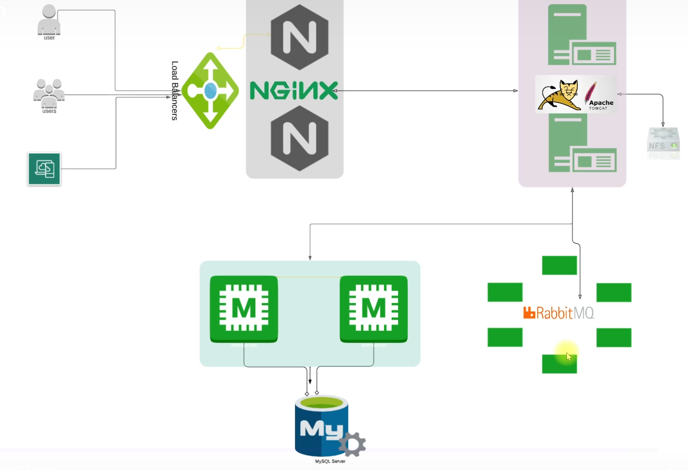

# Requirements
- Vagrant
- VirtualBox
- Gitbash

# Install and deploy
- Clone the repository : git clone https://github.com/Arezki-Nadji/vprofile_vagrant.git
- Vagrant up
- Browser : http://192.168.56.11/
- username : admin_vp
- password : admin_vp

# Architecture 

